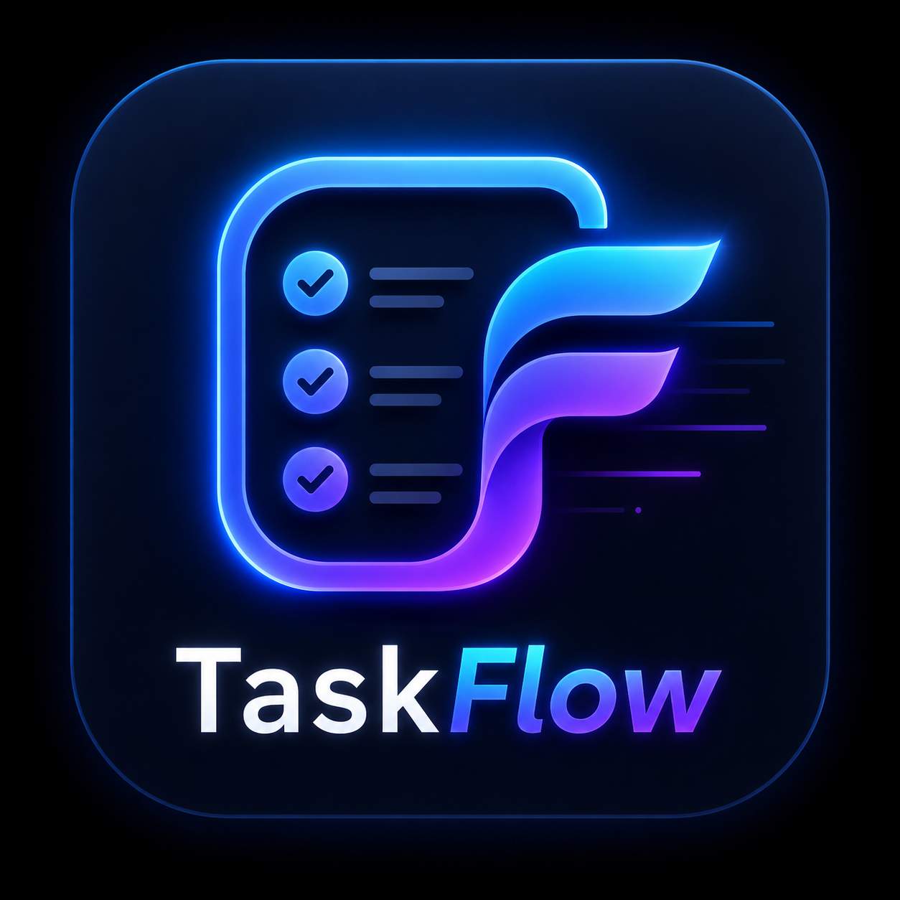

# TaskFlow: Full-Stack Task Manager App



<div align="center">
  
  
  
  
  
</div>


TaskFlow is a comprehensive, production-ready Task Management Application built on the **MERN** stack (MongoDB, Express, React, Node.js). It provides a secure, intuitive, and responsive environment for users to manage their daily workflows, track priorities, and stay on top of deadlines.

## 🚀 Live Demo
- **Frontend (Vercel):** `https://task-flow-task-management-applicati.vercel.app/`
- **Backend API (Render):** `https://taskflow-task-management-application.onrender.com`

## ⚡ Key Features
- **Secure Authentication:** Robust user registration and login flows using JWT (JSON Web Tokens) and bcrypt for password hashing.
- **Full CRUD Operations:** Seamlessly Create, Read, Update, and Delete tasks in real-time.
- **Advanced Filtering & Sorting:** Instantly filter tasks by status (pending/completed) and priority (low/medium/high/critical).
- **Dashboard Analytics:** Real-time statistics generated via complex MongoDB aggregations (Total, Completed, Pending, Overdue).
- **Premium UI/UX:** Built with Tailwind CSS, featuring modern glassmorphism, responsive design, and smooth micro-animations.

## 🛠️ Tech Stack
- **Frontend:** React (Vite), React Router v6, Tailwind CSS, Axios, React Toastify.
- **Backend:** Node.js, Express.js, Mongoose.
- **Database:** MongoDB Atlas.
- **Authentication:** jsonwebtoken (JWT), bcryptjs.

## 📂 Project Structure
```text
taskflow/
├── backend/            # Express API & MongoDB Models
│   ├── config/         # Database connection setup
│   ├── controllers/    # Business logic for Auth & Tasks
│   ├── middleware/     # JWT protection logic
│   ├── models/         # Mongoose Schemas (User, Task)
│   ├── routes/         # API Endpoint definitions
│   └── server.js       # Entry point
└── frontend/           # React Client
    ├── src/
    │   ├── api/        # Axios interceptors for global auth
    │   ├── components/ # Reusable UI pieces (Cards, Forms, Navbar)
    │   ├── context/    # Global State (AuthContext)
    │   ├── pages/      # Route Views (Dashboard, Login, Landing)
    │   └── App.jsx     # Route definitions
    └── vercel.json     # SPA routing configuration for Vercel
```

## 💻 Local Setup Instructions
If you wish to run this project locally, follow these steps:

1. **Clone the repository:**
   ```bash
   git clone <repository-url>
   cd taskflow
   ```

2. **Backend Setup:**
   ```bash
   cd backend
   npm install
   ```
   Create a `.env` file in the `backend` directory with the following variables:
   ```env
   PORT=5000
   MONGO_URI=your_mongodb_connection_string
   JWT_SECRET=your_jwt_secret_key
   NODE_ENV=development
   CLIENT_URL=http://localhost:5173
   ```
   Run the backend: `npm run dev`

3. **Frontend Setup:**
   ```bash
   cd ../frontend
   npm install
   ```
   Create a `.env` file in the `frontend` directory:
   ```env
   VITE_API_URL=http://localhost:5000
   ```
   Run the frontend: `npm run dev`

## 🔒 Security Measures
- **Stateless Auth:** Secure JWTs passed as Bearer tokens in headers.
- **Data Isolation:** All database queries are strictly scoped to the authenticated user's `_id` via backend controllers, preventing horizontal privilege escalation.
- **Environment Variables:** All secrets are kept out of source control.

---
*Developed as a graded full-stack engineering project demonstrating modern web development best practices.*
